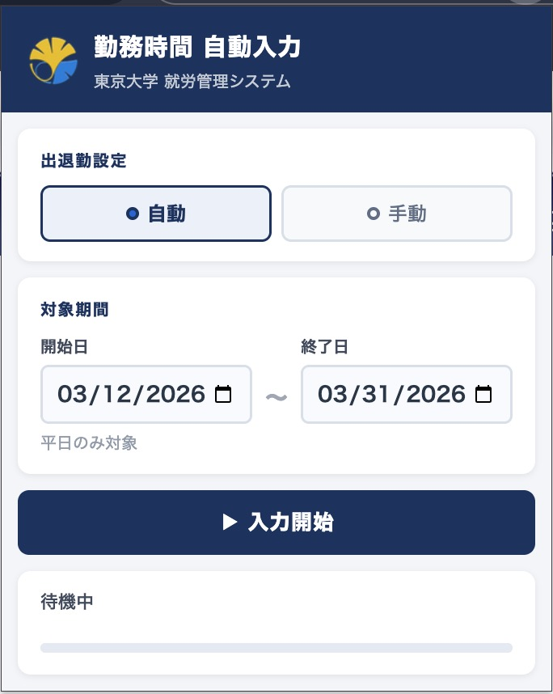
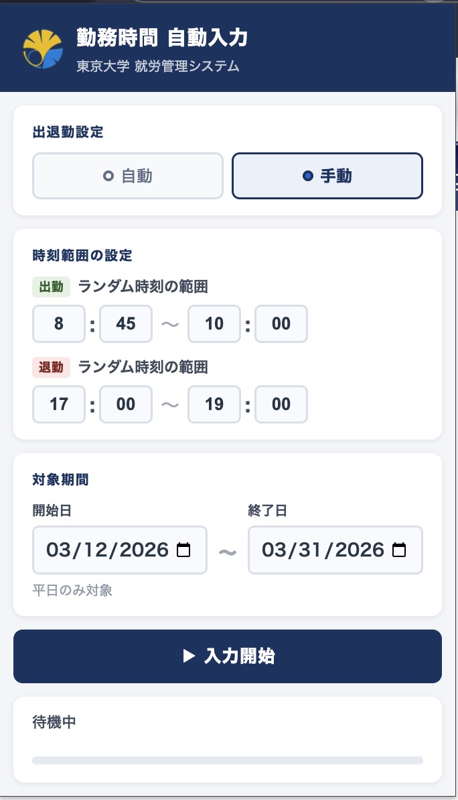

# 勤務時間 自動入力

**東京大学 就労管理システム**向けの自己申告記録（出勤・退勤）を自動入力する Chrome 拡張機能です。

---

## 作成の背景と経緯

2024年11月以降、東京大学において裁量労働制適用教員に対しても、就労管理システムを用いた日々の勤務記録が求められるようになりました。裁量労働制の下であっても事業者が労働時間の状況を把握し、健康確保措置を講じることが制度的に求められているという理解のもと、本学も対応を進めているものです。

しかしながら、実際の運用では日々の入力作業が大きな負担となっています。出勤・退勤時刻の打刻または自己申告、休憩や勤務外時間の入力、休日・深夜の業務命令の有無の確認など、一連の作業を継続的に行う必要があります。学外からの入力にはVPN接続が必要なため、在宅勤務や出張中であっても日々システムにアクセスすることが事実上前提となっています。教育・研究・学生対応の合間にこの作業を組み込むことは想像以上に時間を要し、手続の煩雑さも相まって、業務効率の観点からも大きな負担となっています。過重労働の防止や健康確保を目的とした制度であるはずが、新たに日々の入力・確認という業務が追加されることで、教員側にも事務側にも継続的な作業負担を生じさせており、ある種の逆説的な状況を感じる方も少なくないのではないでしょうか。

本拡張機能は、そのような負担を軽減するために作成しました。自己申告記録（出勤・退勤）の入力に必要な繰り返し作業を自動化し、入力作業に要する時間を削減しながら、正確で適切な記録を維持できるようにすることを目的としています。

**重要：** 本ツールは、実際に勤務した時間の*入力作業*を効率化するためのものです。実際の勤務スケジュールに基づいた時刻のみを入力してください。本拡張機能は、システムの検証や承認プロセスを迂回するものではありません。システムが求める繰り返しのフォーム入力を行うだけです。

---

## 機能

| 機能 | 説明 |
|------|------|
| **自動モード** | 出勤 8:45〜10:00、退勤 17:00〜19:00 の既定範囲を使用 |
| **手動モード** | 出勤・退勤の時刻範囲を任意に設定可能 |
| **平日のみ対象** | 選択した期間内の平日のみを自動的に対象とする |
| **勤務表連動** | 本人用実績入力ページの勤務表から勤務日を判定 |
| **進捗表示** | 入力処理中にリアルタイムで進捗と状態を表示 |
| **停止機能** | いつでも処理を停止可能 |

---

## 必要要件

- **Google Chrome**（または Manifest V3 互換の Chromium 系ブラウザ）
- **東京大学アカウント**（UTokyo Account）でシステムにログイン可能
- **就労管理システムのページでアクティブなセッション**があること

本拡張機能は、東京大学就労管理システムのドメイン（`ut-ppsweb.adm.u-tokyo.ac.jp`）でのみ動作します。

---

## インストール（開発者モード）

本拡張機能は Chrome の開発者モードで読み込む必要があります。

### 1. ダウンロード

- **[Releases ページ](https://github.com/JGKarlin/ut-cws-helper/releases)** から最新版の **ZIP ファイル** をダウンロードし、解凍してください。
- または [リポジトリ](https://github.com/JGKarlin/ut-cws-helper) の **Code** → **Download ZIP** をクリックしてダウンロードし、解凍してください。

### 2. Chrome に読み込む

1. Chrome のメニューから **拡張機能** を開きます。
   - **Windows：** メニュー（⋮）→ **拡張機能** → **Chrome ウェブストア**
   - **macOS：** メニュー（⋮）→ **拡張機能** → **Chrome ウェブストア**
   - またはアドレスバーに `chrome://extensions` と入力して Enter
2. 右上の **開発者モード** のトグルをオンにします。
3. **パッケージ化されていない拡張機能を読み込む** をクリックし、解凍した拡張機能のフォルダ（`manifest.json` が含まれるフォルダ）を選択します。

これでインストール完了です。必要に応じてツールバーにピン留めしてください。

---

## 使い方

### 基本的な流れ

1. ブラウザで就労管理システムに**ログイン**します。
2. Chrome ツールバーの拡張機能アイコンをクリックして**拡張機能を開きます**。
3. 設定を**構成**します（下記参照）。
4. **「入力開始」** をクリックして開始します。

本拡張機能は、就労管理システムのページ（例：メインメニューや `ut-ppsweb.adm.u-tokyo.ac.jp` 上の任意のページ）を**開いている状態**で使用してください。

---

### 設定項目

#### 出退勤設定

- **自動：** 出勤 8:45〜10:00、退勤 17:00〜19:00 の既定範囲を使用します。
- **手動：** 出勤・退勤の時刻範囲を任意に設定できます。各日の時刻は設定した範囲内でランダムに選択されます。

#### 対象期間

- **開始日：** 対象期間の最初の日
- **終了日：** 対象期間の最後の日
- **平日のみ対象：** 平日のみが処理対象となり、土日は除外されます。

---

### 使用例（スクリーンショット）

#### 1. 自動モード（既定設定）

**自動** を選択すると、日付範囲と対象期間のみが表示されます。**入力開始** をクリックして開始します。



---

#### 2. 手動モード（時刻範囲の設定）

**手動** を選択すると、出勤・退勤の時刻範囲を設定できます。各日の時刻は設定した範囲内でランダムに選択されます。



---

### 実行中

- 拡張機能がシステム内を自動的にナビゲートします。
- ポップアップに進捗（ステータステキストとプログレスバー）が表示されます。
- いつでも **停止** をクリックして処理を中断できます。
- セッションが切れた場合やエラーが発生した場合は、再度ログインしてやり直す必要がある場合があります。

---

## 技術仕様

- **Manifest バージョン：** 3
- **権限：** `activeTab`、`scripting`、`storage`、`tabs`、および `ut-ppsweb.adm.u-tokyo.ac.jp` へのホストアクセス
- **コンテンツスクリプト：** 就労管理システムのページで動作し、ナビゲーションとフォーム入力を行います。

---

## 免責事項

本拡張機能は非公式ツールです。東京大学とは関係がなく、東京大学による推奨も受けていません。使用は自己責任でお願いします。本拡張機能は、手動での勤務時間入力の負担を軽減しつつ、実際の勤務時間の正確な記録を維持したい方のために、現状のまま提供されています。

---

## プロジェクト構成

```
├── manifest.json      # 拡張機能マニフェスト（Manifest V3）
├── background.js      # サービスワーカー（ストレージアクセス）
├── content.js         # コンテンツスクリプト（就労管理システムページで動作）
├── popup.html         # 拡張機能ポップアップ UI
├── popup.js           # ポップアップロジックと自動化の制御
├── icons/             # 拡張機能アイコン（16、48、128 px）
│   ├── icon16.png
│   ├── icon48.png
│   └── icon128.png
└── README.md          # 本ファイル
```

---

## ライセンス

[ご希望のライセンスを記載してください。例：MIT、Apache 2.0]
